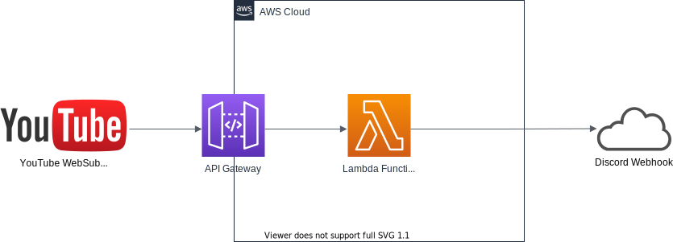

# youtube-websub-to-discord-webhook

## Requirements

### Tools

- Go 1.16 or later

### For Deployment

- AWS Account
- [aws-sam-cli](https://docs.aws.amazon.com/serverless-application-model/latest/developerguide/serverless-sam-cli-install.html)

## Architecture



## Building and Deployment

### Environment Variables

- `SAM_PACKAGE_BUCKET`: Target bucket to package sam application
- `DEPLOY_STACK_NAME`: Stack name to deploy

### Build

```shell
$ make build
```

### Package

```shell
$ make package
```

### Deploy

```shell
$ make deploy
```
